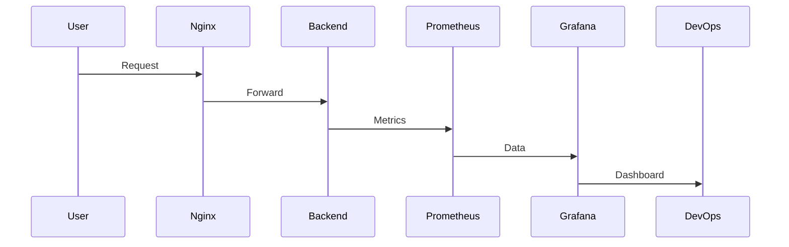

<!-- ================== TOP BANNER ================== -->

<p align="center">

</p>

---

# 🐳 Docker DevOps Monitoring Project

### Prometheus • Grafana • Nginx • Node.js

<h3 align="center">Production-Style Containerized Monitoring Architecture</h3>

---

<p align="center">


</p>

---

# 🌟 Project Overview

This project demonstrates how DevOps engineers deploy and monitor containerized applications using Docker.  
We simulate a real-world production setup where an application runs inside containers and its metrics are collected and visualized.

This project includes:

* Containerized backend application  
* Reverse proxy using Nginx  
* Metrics collection using Prometheus  
* Visualization using Grafana  

---

# 🧠 What You Will Learn

* Docker containerization  
* Multi-container architecture  
* Monitoring and observability  
* Prometheus metrics scraping  
* Grafana dashboards  
* DevOps workflow  

---

# 🏗️ Architecture

```mermaid
flowchart LR
    User --> Nginx
    Nginx --> Backend
    Backend --> Prometheus
    Prometheus --> Grafana


# 🐳 Docker DevOps Monitoring Project

### Prometheus • Grafana • Nginx • Node.js

<h3 align="center">Production-Style Containerized Monitoring Architecture</h3>

---

<p align="center">


</p>

---

# 🌟 Project Overview

This project demonstrates how DevOps engineers deploy and monitor containerized applications using Docker.
We simulate a real-world production setup where an application runs inside containers and its metrics are collected and visualized.

This project includes:

* Containerized backend application
* Reverse proxy using Nginx
* Metrics collection using Prometheus
* Visualization using Grafana

---

# 🧠 What You Will Learn

* Docker containerization
* Multi-container architecture
* Monitoring and observability
* Prometheus metrics scraping
* Grafana dashboards
* DevOps workflow

---

# 🏗️ Architecture

```mermaid
flowchart LR
    User --> Nginx
    Nginx --> Backend
    Backend --> Prometheus
    Prometheus --> Grafana
```

---

# 🔄 Request Flow



---

# 📁 Project Structure

```
docker-devops-project/
│
├── docker-compose.yml
│
├── backend/
│   ├── app.js
│   ├── package.json
│   └── Dockerfile
│
├── nginx/
│   └── nginx.conf
│
├── prometheus/
│   └── prometheus.yml
│
└── README.md
```

---

# 🚀 Step-by-Step Creation

## 1️⃣ Create Project Folder

```bash
mkdir docker-devops-project
cd docker-devops-project
```

## 2️⃣ Create Folders

```bash
mkdir backend nginx prometheus
touch docker-compose.yml
```

---

## 3️⃣ Backend Setup

```bash
cd backend
nano app.js
```

Paste backend code.

Create package file:

```bash
nano package.json
```

Create Dockerfile:

```bash
nano Dockerfile
```

---

## 4️⃣ Nginx Setup

```bash
cd ../nginx
nano nginx.conf
```

---

## 5️⃣ Prometheus Setup

```bash
cd ../prometheus
nano prometheus.yml
```

---

## 6️⃣ Docker Compose

```bash
cd ..
nano docker-compose.yml
```

---

# ▶️ Run Project

```bash
docker compose up -d --build
```

---

# 🌐 Access Services

| Service     | URL                   |
| ----------- | --------------------- |
| Application | http://SERVER-IP      |
| Prometheus  | http://SERVER-IP:9090 |
| Grafana     | http://SERVER-IP:3000 |

Grafana login:

```
admin / admin
```

---

# 📊 Grafana Query

```
rate(http_requests_total[1m])
```

---

# 🧪 Generate Traffic

```bash
for i in {1..200}; do curl http://localhost/api; done
```


# 👨‍💻 Author

**Arkan Tandel**
DevOps Engineer 🚀

LinkedIn: https://www.linkedin.com/in/arkan-tandel
GitHub: https://github.com/arkantandel

---

<!-- ================== FOOTER ================== -->

<p align="center">

</p>
