# 🚀 ENTERPRISE DEVOPS MONITORING PLATFORM

## Docker • Prometheus • Grafana • Nginx • Redis • Node.js


---

# 👨‍💻 DevOps Engineer

**Arkan Tandel**

🔗 LinkedIn: https://www.linkedin.com/in/arkan-tandel
🔗 GitHub: https://github.com/yourusername
🔗 Portfolio: https://yourportfolio.com

---

# 🌍 PROJECT OVERVIEW

This project demonstrates a **production-grade DevOps monitoring stack** built using containerized microservices.

It simulates how modern companies monitor:

* Application traffic
* Performance
* Metrics
* CPU usage
* Request rate
* System health

All deployed using **Docker Compose** with full observability.

---

# 🎯 OBJECTIVE

Build a complete monitoring system that can:

* Track backend API requests
* Visualize metrics in Grafana
* Scrape metrics using Prometheus
* Handle traffic with Nginx
* Use Redis for caching
* Run everything in Docker

---

# 🧱 ENTERPRISE ARCHITECTURE

```mermaid
flowchart TB
    user[👤 User Browser]
    nginx[🌐 Nginx Proxy]
    backend[⚙️ Node Backend]
    redis[(🧠 Redis Cache)]
    prom[📊 Prometheus]
    grafana[📈 Grafana]
    devops[👨‍💻 DevOps]

    user --> nginx
    nginx --> backend
    backend --> redis
    backend -->|metrics| prom
    prom --> grafana
    grafana --> devops
```



---

# 🧠 HOW SYSTEM WORKS

1. User sends request
2. Nginx forwards request
3. Backend processes request
4. Metrics generated
5. Prometheus scrapes metrics
6. Grafana visualizes metrics

---

# 🏗️ REAL PRODUCTION FLOW


---

# 📁 PROJECT STRUCTURE

```
devops-monitoring-project
│
├── backend
│   ├── app.js
│   ├── package.json
│   ├── Dockerfile
│
├── nginx
│   └── nginx.conf
│
├── prometheus
│   └── prometheus.yml
│
├── docker-compose.yml
└── README.md
```

---

# ⚙️ COMPLETE SETUP

## Step 1 — Clone

```bash
git clone https://github.com/yourusername/devops-monitoring-project
cd devops-monitoring-project
```

## Step 2 — Start Project

```bash
docker compose up -d --build
```

## Step 3 — Check Containers

```bash
docker ps
```

---

# 🌐 ACCESS SERVICES

| Service     | URL                   |
| ----------- | --------------------- |
| Grafana     | http://SERVER-IP:3000 |
| Prometheus  | http://SERVER-IP:9090 |
| Backend API | http://SERVER-IP/api  |

---

# 📊 PROMETHEUS TEST

Open:

```
http://SERVER-IP:9090
```

Query:

```
http_requests_total
```

---

# 📈 GRAFANA METRICS

### Request Rate

```
rate(http_requests_total[1m])
```

### Total Requests

```
http_requests_total
```

### CPU Usage

```
process_cpu_seconds_total
```

---

# 🧪 GENERATE TRAFFIC

Run:

```bash
for i in {1..500}; do curl http://SERVER-IP/api?name=test; done
```

Graph will increase 📈

---

# 🖼️ DASHBOARD IMAGES

Add screenshots here:

```
images/grafana-dashboard.png
images/prometheus.png
images/docker.png
```

---

# 🧠 WHAT YOU LEARN

✔ Docker networking
✔ Monitoring stack
✔ Observability
✔ Metrics scraping
✔ Reverse proxy
✔ Production architecture

---

# 🔥 ADVANCED DEVOPS DIAGRAM


---

# ☁️ CLOUD READY VERSION

This project can be deployed on:

* AWS EC2
* Kubernetes
* EKS
* Docker Swarm

---

# 🚀 FUTURE IMPROVEMENTS

* CI/CD pipeline
* Kubernetes
* Alertmanager
* Slack alerts
* Terraform infra

---

# 💼 RESUME DESCRIPTION

**DevOps Monitoring Stack Deployment**

Deployed a containerized microservice monitoring system using Docker, Prometheus, and Grafana to visualize real-time performance metrics and improve system observability.

---

# 🧑‍💻 INTERVIEW QUESTIONS

**Q:** How does Prometheus collect metrics?
**A:** It scrapes metrics endpoint `/metrics`.

**Q:** Why Grafana?
**A:** Visualization of metrics.

**Q:** What is rate() query?
**A:** Calculates per-second request rate.

---

# ⭐ STAR THIS REPO

If this helped you, star ⭐ the repo.

---

# 🔗 CONNECT

LinkedIn
https://www.linkedin.com/in/arkan-tandel

GitHub
https://github.com/yourusername

---

